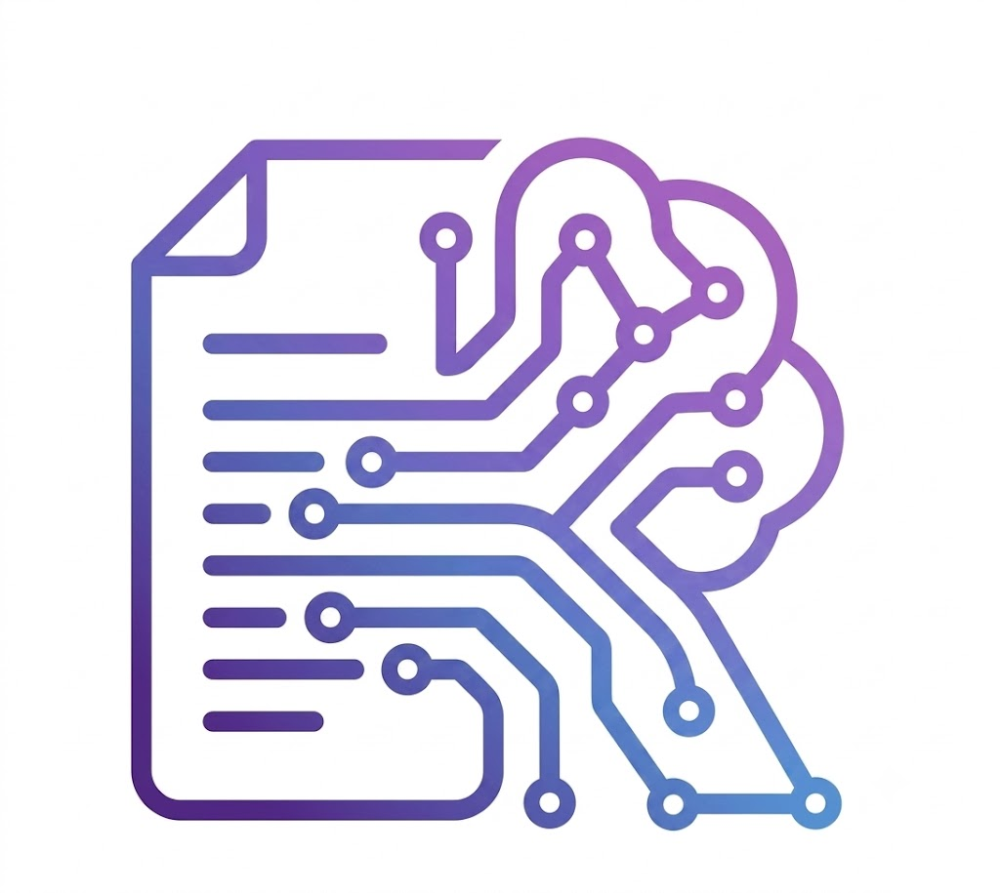

<p align="center">
  
</p>

<h1 align="center">ResumeIQ — AI Resume Analyzer & ATS Optimization Desktop Suite</h1>

<p align="center">
  
  
  
  
  
  
  
</p>

**ResumeIQ** is an AI-powered desktop suite built with Python 3.11, PyQt6, spaCy NLP, Google Gemini AI, and ReportLab 5. It uses Artificial Intelligence across key modules:
- **Google Gemini AI & spaCy NLP:** Extracts candidate entities (names, emails, phone, location), skills, education background, past job titles, and work experience duration in years and months.
- **Universal AI Role Prediction:** Evaluates candidate profiles to predict top matching job roles across all global industries (Tech, Healthcare, Education, Legal, Engineering, Finance, Business, HR, Sales, Creative, etc.).
- **AI Career Assistance & Optimization:** Provides tailored resume optimization suggestions and conversational AI career advice.
- **Executive PDF Evaluation Generator:** Produces single-page ReportLab vector PDF reports with MCDA ATS matching scores and 5-Star visual ratings.

---

## 👨‍💻 Developer Information

* **Developer:** **Pranab Chourasiya**
* **LinkedIn Profile:** [linkedin.com/in/pranab-chourasiya-87409735b](https://www.linkedin.com/in/pranab-chourasiya-87409735b/)
* **GitHub Profile:** [github.com/pranab1411](https://github.com/pranab1411)
* **GitHub Repository:** [github.com/pranab1411/ResumeIQ](https://github.com/pranab1411/ResumeIQ)
* **Contact Email:** [pranabchourasiya876@gmail.com](mailto:pranabchourasiya876@gmail.com)

---

## 🌟 Key Features

1. **100% On-Device & Private (Zero Cloud Transmission)**:
   - Complete local processing — resumes, candidate names, and contact details never leave your computer.
2. **Multi-Format Resume Parsing**:
   - Multi-format text extraction (PDF, DOCX, TXT, RTF, ODT, HTML) with OCR image fallback.
   - spaCy Named Entity Recognition (NER) for Candidate Name, Email, and Phone Number.
   - Smart header recognition for *"About Me"*, *"Profile"*, *"Personal Profile"*, and *"Executive Summary"*.
   - Curated domain taxonomy skill extraction across **22 tech and non-tech role categories** (350+ skills).
3. **4-Pillar MCDA Scoring Engine**:
   - Multi-Criteria Decision Analysis scoring model:
     $$\text{ATS Score} = (0.40 \times \text{Skills}) + (0.25 \times \text{TF-IDF Cosine}) + (0.20 \times \text{Hygiene/Format}) + (0.15 \times \text{Experience})$$
   - Granular 5-star rating system (0.0 to 5.0 Stars) supporting fractional vector representations.
   - Score categorization: *Needs Improvement* (<50%), *Average* (50–75%), *Excellent* (>75%).
4. **Target Job Role Prediction**:
   - Predicts top matching job roles based on skills extracted from the candidate's resume (e.g. *Full Stack Developer*, *Data Scientist*, *Desktop Support Engineer*, *DevOps Engineer*).
5. **Simulated Enterprise ATS Profiles**:
   - Heuristic multi-criteria profiling simulating enterprise ATS evaluation priorities (Workday, Oracle Taleo, Greenhouse, Lever, iCIMS).
6. **Executive PDF Evaluation Report Export**:
   - Generates a single-page ReportLab vector PDF report containing candidate metrics, overall 5-star rating breakdown, section analysis status table, extracted evidence, and actionable recommendations.
7. **Dedicated "About Developer" Page**:
   - Integrated dark glassmorphic page detailing developer credentials, mission promise, tech stack matrix, and direct contact buttons.

---

## 🔑 How to Get a Free Google Gemini API Key

ResumeIQ features **Hybrid Cloud + On-Device AI Architecture**. While the application works 100% offline using spaCy NLP, configuring a **Google Gemini API Key** unlocks cloud AI candidate evaluation, dynamic multi-industry suggestions, and AI career advice.

Follow these 4 quick steps to obtain your free Gemini API Key:

1. **Visit Google AI Studio:**
   - Open your browser and go to [aistudio.google.com/app/apikey](https://aistudio.google.com/app/apikey).
2. **Sign In:**
   - Log in with any Google account.
3. **Generate Key:**
   - Click **"Create API Key"** (or **"Get API key"**).
   - Select a project (or let Google create a default workspace project) and click **Create API Key in new project**.
   - Copy your generated key (starts with `AIzaSy...`).
4. **Configure in ResumeIQ:**
   - Launch **ResumeIQ** and navigate to ⚙️ **Settings** (Page 7) -> **Google Gemini AI Configuration**.
   - Paste your key into the text box and click **Save Key**.
   - Click **⚡ Test Connection**. Once connected, your header badge will display `✨ Google Gemini AI Active` in emerald green!

> [!NOTE]  
> Google Gemini API keys from Google AI Studio are **100% free** with generous daily quota limits suitable for individual and recruiter use.

---

## 📁 Directory Structure

```text
ResumeIQ/
├── assets/                  # Domain skills taxonomy & UI vector assets
│   ├── skills.json          # 22-category tech & non-tech skills taxonomy
│   ├── names_db.json        # Global first & last names database
│   ├── app_icon.ico         # Application icon
│   └── logo.png             # ResumeIQ visual logo
├── config/
│   ├── version.py           # Application version & build configuration
│   ├── ats_config.json      # Configurable ATS weights, thresholds & benchmarks
│   └── smtp_config.py       # Environment-based SMTP configuration
├── database/
│   ├── database.py          # SQLite connection manager with WAL mode & CRUD
│   └── resumeiq.db          # Local SQLite database
├── modules/
│   ├── ats_calculator.py    # 4-Pillar MCDA scoring, skill normalization & role predictor
│   ├── ats_benchmark.py     # RQI, Content Strength & industry benchmark engine
│   ├── mnc_ats_engine.py    # Simulated enterprise ATS compatibility engine
│   ├── nlp_engine.py        # spaCy extraction engine & skill matcher
│   ├── parser.py            # Unified multi-format document parser
│   ├── report_generator.py  # ReportLab executive PDF report generator
│   └── scheduler.py         # Periodic background rescan scheduler
├── tests/                   # Automated unit test suite
│   ├── test_ats_calculator.py
│   ├── test_database.py
│   ├── test_nlp_engine.py
│   ├── test_parsers.py
│   └── test_report_generator.py
├── ui/                      # PyQt6 GUI components & dark theme stylesheets
│   ├── about_developer_page.py # About Developer & Engine Architecture view
│   ├── dashboard_window.py  # Main Dashboard window & navigation stack
│   ├── login_window.py      # Login & Registration UI
│   ├── profile_page.py      # Candidate Profile & Target Role settings
│   ├── glass_message_box.py # Custom glassmorphic notifications
│   ├── onboarding_tour.py   # Interactive onboarding tour wizard
│   ├── floating_widget.py   # Desktop floating glass view
│   ├── closing_screen.py    # Animated shutdown splash screen
│   └── styles.py            # Dark theme QSS design tokens
├── utils/                   # Security, logging & path helpers
│   ├── gemini_client.py     # Gemini REST client fallback
│   ├── logger.py            # Central logging utility
│   └── security.py          # Password hashing & validation
├── main.py                  # Application entry point
├── build_test.py            # Automated Inno Setup test build compiler
├── build_installer.py       # Inno Setup production build compiler
├── installer_setup.iss      # Inno Setup installer script
├── requirements.txt         # Dependencies manifest
└── README.md                # Documentation
```

---

## 🚀 Getting Started

### Prerequisites
- Python 3.10+ (Recommended: Python 3.11 / 3.12 64-bit)
- Virtual environment (`venv`)

### Installation

1. Activate virtual environment (Windows):
   ```powershell
   .\venv\Scripts\activate
   ```

2. Install required packages:
   ```bash
   pip install -r requirements.txt
   ```

3. Download spaCy English language model:
   ```bash
   python -m spacy download en_core_web_sm
   ```

4. Launch the Application:
   ```bash
   python main.py
   ```

---

## 🧪 Running Automated Test Suite

Run the full automated unit test suite (38 tests):

```powershell
$env:PYTHONPATH="."; python -m unittest discover -s tests -p "test_*.py"
```

---

## 📦 Building Installers & Automated Setup

Compile an installable Windows setup executable wizard (`test_builds/ResumeIQ v2.1 test build <N>.exe`):

```powershell
python build_test.py
```

---

## 📝 License & Restrictions
Designed & Engineered by **Pranab Chourasiya**. Copyright (c) 2026. All Rights Reserved.

ResumeIQ is provided as **Free-of-Charge Software** under a **Proprietary Freeware License** subject to the following terms:
* 🆓 **Free to Use:** Free for personal, non-commercial use.
* 🚫 **No Resale:** Selling, reselling, sublicensing, or charging fees for this software is strictly prohibited and illegal.
* 🔒 **No Modification:** Modifying, decompiling, reverse engineering, or creating derivative works of this software is strictly prohibited under any condition.

See the full **[LICENSE](file:///d:/py%20project/ResumeIQ/LICENSE)** file for complete terms.
